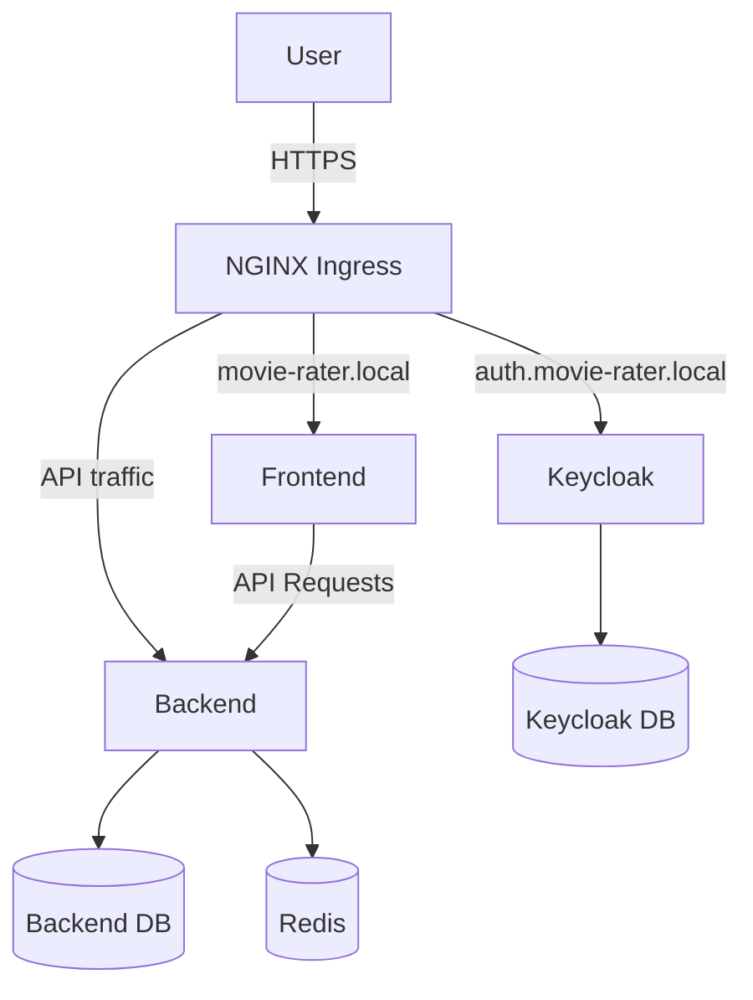

# 🎬 Movie Rater — Kubernetes & DevOps Project

## Project Overview

Movie Rater is a web application for managing and rating movies, built as a **containerized multi-service application deployed on Kubernetes**.

The main goal of this project was  to demonstrate **practical DevOps and Kubernetes skills**  including container orchestration, service networking, persistent storage, secrets management, TLS termination, ingress configuration, network policies, and horizontal autoscaling.

The entire environment can be deployed locally using **Kind (Kubernetes in Docker)**.

## Project structure

```
Movie-rater/
│
├── app/
│   ├── backend/
│   └── frontend/
│
├── k8s/
│   ├── backend/
│   ├── frontend/
│   ├── keycloak/
│   ├── postgres/
│   ├── redis/
│   ├── ingress.yaml
│   ├── namespace.yaml
│   └── network.yaml
│
├── docker-compose.yaml
└── run.sh
```

## Architecture

The application is composed of several independent Kubernetes workloads:

- **Frontend** — web interface for interacting with the application
- **Backend** — application API and business logic
- **PostgreSQL** — persistent relational database
- **Redis** — in-memory data store
- **Keycloak** — identity and access management
- **NGINX Ingress** — external traffic routing and HTTPS entry point

All components are deployed inside a dedicated `movie-rater` Kubernetes namespace.



## Technologies

[](https://react.dev/)
[](https://nodejs.org/)
[](https://expressjs.com/)
[](https://www.postgresql.org/)
[](https://redis.io/)
[](https://www.docker.com/)
[](https://kubernetes.io/)
[](https://kind.sigs.k8s.io/)
[](https://nginx.org/)
[](https://www.keycloak.org/)
[](https://jwt.io/)

## Quick start

To start the application please refer to the [instructions](./INSTRUCTIONS.md).